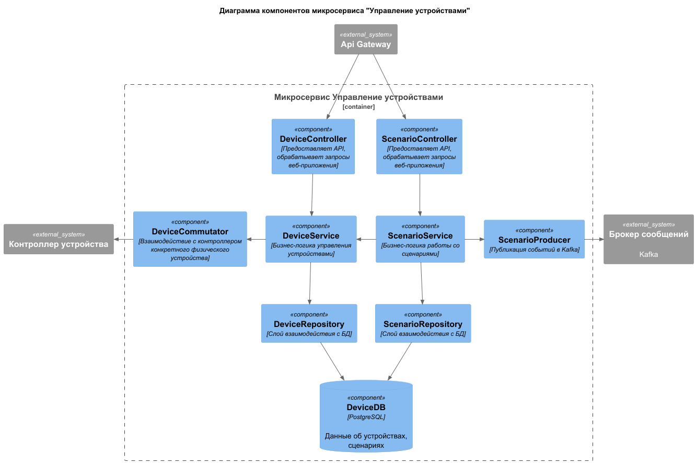
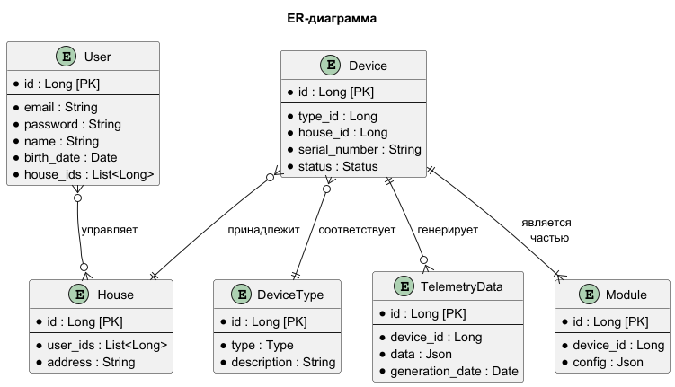

# Задание 1. Анализ и планирование

### 1. Описание функциональности монолитного приложения

**Управление отоплением:**

- Пользователи могут удалённо
  - получать информацию о системе отопления (включена ли она сейчас, какая целевая температура) `GET /api/heating/{id}`
  - обновлять параметры системы отопления (состояние - вкл/выкл, значение целевой температуры) `POST /api/heating/{id}`
  - включать отопление в своих домах `POST /api/heating/{id}/turn-on` 
  - выключать отопление в своих домах `POST /api/heating/{id}/turn-off`
  - устанавливать целевую температуру `POST /api/heating/{id}/set-temperature`

- Система поддерживает
  - отправку команд / обмен данными со 100 подключенными модулями управления отоплением 
  - возможность удаленного управления каждым модулем в отдельности через приложение (запросы с сервера по http-протоколу)
  - включения/выключения отопления
  - установки целевой температуры в доме

**Мониторинг температуры:**

- Пользователи могут удалённо
  - получать информацию о текущей температуре с датчиков `GET /api/heating/{id}/current-temperature`

- Система поддерживает
  - отправку данных с датчиков о текущей температуре в ответ на запрос из приложения (по http-протоколу)
  - стабильную работу 100 веб-клиентов одновременно

### 2. Анализ архитектуры монолитного приложения

- **Язык программирования**: Java
- **База данных**: PostgreSQL
- **Архитектура**: Монолитная, все компоненты системы (обработка запросов, бизнес-логика, работа с данными) находятся в рамках одного приложения
- **Взаимодействие**: Синхронное, запросы обрабатываются последовательно
- **Масштабируемость**: Ограничена, так как монолит сложно масштабировать по частям
- **Развёртывание**: Требует остановки всего приложения.

### 3. Определение доменов и границы контекстов

- Домен "Система управления отоплением"
  - Отвечает за отправку команд системе управления отоплением, установленной в доме (вкл/выкл, установка целевой температуры); получение информации о состоянии системы  
  - Понятия контекста:
    - целевая температура - параметр системы управления отоплением определяющей какая температура в итоге должна быть в доме (задается через веб-приложение)

- Домен "Система мониторинга температуры (датчики)"
  - Отвечает за сбор информации с датчиков температуры, установленных в доме и отправку их в веб-приложение в ответ на запрос
  - Понятия контекста:
    - текущая температура - температура в доме на момент запроса информации с датчика  

### 4. Проблемы монолитного решения

- Пользователь не может самостоятельно подключить свой/новый датчик к системе. Нужны описанные протоколы взаимодействия новых модулей/датчиков с экосистемой и сервис для работы с внешними партнерами - поставщикам устройств, поддерживающих описанные протоколы. 
- Система позволяет управлять только одним типом модулей/датчиками (температура). Добавление нового устройства требует внесения изменений в код монолита, деплоя всего приложения целиком. Для решения этих проблем эффективно использовать микросервисную архитектуру.
- Все управление и данные идут по запросам от сервера к модулю управления температурой/датчику
- Ожидается 1000 кратное увеличение кол-ва подключенных модулей и соответствующее увеличение нагрузки на все компоненты системы. Должна быть предусмотрена помодульная возможность масштабирования системы.
- Один инстанс приложения, одна БД - все это является единой точкой отказа. Нужна возможность горизонтального масштабирования системы.
- Синхронность запросов может быть узким местом при возросшей нагрузке на систему.
- В текущем монолитном решении нет модуля управления пользователями. Нужно разграничивать права доступа к устройствам и данным мониторинга.  

### 5. Визуализация контекста системы - диаграмма С4

Диаграмма контекста монолитного приложения "Тёплый дом" ([исходник в формате puml](smart-home-monolith/diagrams/1-5-monolith-context.puml))

# Задание 2. Проектирование микросервисной архитектуры

**Диаграмма контейнеров (Containers)**

Т.к. у нас раньше не была отображена диаграмма Контекста `to-be` системы, на диаграмме контейнеров так же отобразил внешние системы.

[Исходник в формате puml](smart-home-monolith/diagrams/2-1-microservices-containers.puml)

**Диаграмма компонентов (Components)**

1. Диаграмма компонентов микросервиса "Управление устройствами" | [Исходник в формате puml](smart-home-monolith/diagrams/2-2-microservices-components-devices.puml)

2. Диаграмма компонентов микросервиса "Система мониторинга" | [Исходник в формате puml](smart-home-monolith/diagrams/2-2-microservices-components-monitoring.puml)

**Диаграмма кода (Code)**

1. Диаграмма перехода для отправки уведомления о событии произошедшем по сценарию | [Исходник в формате puml](smart-home-monolith/diagrams/2-3-microservices-code-sequence.puml)

2. Диаграмма классов сервиса Управления теплом | [Исходник в формате puml](smart-home-monolith/diagrams/2-3-microservices-code-class.puml)

# Задание 3. Разработка ER-диаграммы

Связи между сущностями:
- **User - House**: пользователь может управлять несколькими домами, а может не управлять ни одним; в то же время дом может быть под управлением нескольких пользователей, а может не быть под управлением вообще
- **Device - DeviceType**: устройство может быть строго одного типа; один тип может быть назначен нескольким устройствам (или устройств с таким типом может не быть)
- **Device - House**: устройство может принадлежать только одному дому; в доме может быть несколько устройств (или не быть вообще)
- **Device - TelemetryData**: одно устройство может генерировать множество записей телеметрии; но одна конкретная телеметрия сгенерирована одним конкретным устройством
- **Device - Module**: модуль может быть составной частью только одного устройства; в то же время в устройстве должен быть как минимум один модуль

[Исходник в формате puml](smart-home-monolith/diagrams/3-1-microservices-er.puml)

